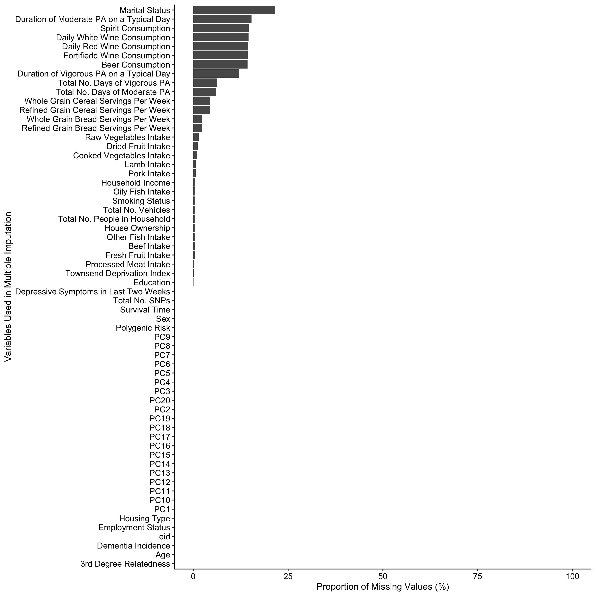

# Intro
This notebook includes the data documentation to the manuscript _Socioeconomic Deprivation, Genetic Risk and Incident Dementia_.

## Folder structure
Folders contained in the project are the following:
* ./data should contain prepared data files after fetching, imputing and preprocessing (e.g. genetic risk score computation)
* ./plots will contain main figures after running the markdown code
* ./code contains scripts including function definitions

\newpage

## Instructions
You have two options to use this data documentation: You can either,
* read the already knitted pdf document including all graphs and tables of the main document,
* or run the markdown code chunks, thereby retrieving graphs and tables in place. 

In the latter case, you need to fetch and preprocess the data yourself. Preprocessing steps involve, amongst other things, application of eligibility criteria, computation of survival times, identification of dementia cases, imputation of missing data, computation of the genetic risk and healthy lifestyle score as well as computation and classification of individual- and area-level socioeconomic deprivation groups. 
These steps result in 5 equally sized imputed data files (for which results will be pooled) and 1 complete case data file. The 6 files should be stored in ./data.
You can then continue to open the markdown file ./20210104_Deprivation_x_Genetics.Rmd and run single chunks consecutively or knit the document at once. Please note the required packages listed below.

* tidyverse
* knitr
* survival
* broom
* mice
* scales
* ggplot2
* datawizard
* haven
* epiR
* ipw
* survey
* cobalt
* data.table

```{r echo = FALSE, message = FALSE}
# setup
knitr::opts_chunk$set(echo=FALSE)
knitr::opts_chunk$set(cache=TRUE)
knitr::opts_chunk$set(message=FALSE)
knitr::opts_chunk$set(warning=FALSE)
```


```{r}
# load functions
source("./code/20220322_func.R")
```

\newpage

You can then either load your data following the naming conventions that are illustrated in the code chunk below or adapt the markdown file to match your naming with regard to data files and column names.


```{r}
variables = read.csv2("./data/variables.csv", col.names = c("Variable", "Definition", "Type", "Scale"))
variables %>% kable(format = "latex",
                    align = "l", 
                    booktabs = TRUE,
                    longtable = TRUE,
                    linesep = "") %>% 
  kableExtra::kable_styling(latex_options = c("HOLD_position", "repeat_header")) %>% 
  kableExtra::row_spec(0, bold = T) %>% 
  kableExtra::column_spec(c(1, 2, 4), width = "4.2cm") %>% 
  kableExtra::column_spec(3, width = "2.4cm")
```


```{r}
# load files (5 imputed data files, 1 complete case data file)
load("./data/20220629final_vars_aug.RData")
load("./data/20220629final_vars_aug_imp1.RData")
load("./data/20220629final_vars_aug_imp2.RData")
load("./data/20220629final_vars_aug_imp3.RData")
load("./data/20220629final_vars_aug_imp4.RData")
load("./data/20220629final_vars_aug_imp5.RData")

# set data list including the 5 imputed data files for easier pooling
ds_list = list(final_vars_aug.imp1, 
               final_vars_aug.imp2, 
               final_vars_aug.imp3, 
               final_vars_aug.imp4, 
               final_vars_aug.imp5)
```

\newpage

# Analyses

## Table 1. Baseline Characteristics of Participants.

```{r}

# --------- data init --------- #

## row bind 5 imputed data files
rbind_data = ds_list[1] %>% as.data.frame() %>% 
    rbind(ds_list[2] %>% as.data.frame()) %>% 
    rbind(ds_list[3] %>% as.data.frame()) %>% 
    rbind(ds_list[4] %>% as.data.frame()) %>% 
    rbind(ds_list[5] %>% as.data.frame())

print_table1(rbind_data, ds_list) %>% 
  kable(format = "latex", align = c("l"), booktabs = TRUE) %>% 
  kableExtra::row_spec(c(0, 1, 2, 5, 10, 11, 15, 16, 20, 23), bold = T) %>% 
  kableExtra::kable_styling(position = "center", latex_options = c("HOLD_position")) %>% 
  kableExtra::column_spec(1:3, width = "5cm")
```

\newpage

## Table 2. Risk of Incident Dementia by Area-Level Socioeconomic Deprivation Category

```{r}

# --------- basic confounders init --------- #

formula_basic_c_string = "degree3 + pc1 + pc2 + pc3 + pc4 + pc5 + pc6 + pc7 + pc8 + pc9 + pc10 + pc11 + pc12 + pc13 + pc14 + pc15 + pc16 + pc17 + pc18 + pc19 + pc20 + sex + age + edu_new + marital_status"
```


```{r}

# --------- model 1 - baseline adjustments --------- #

res_area1_pooled = coxmodel_then_pool(paste(formula_basic_c_string, "tdi_bin", sep = " + "), ds_list)

# --------- model 2 - model 1 + polygenic risk --------- #

res_area2_pooled = coxmodel_then_pool(paste(formula_basic_c_string, "tdi_bin + Sprs_tert + cnt1", sep = " + "), ds_list)

# --------- model 3 - model 2 + individual-level socioeconomic deprivation --------- #

res_area3_pooled = coxmodel_then_pool(paste(formula_basic_c_string, "tdi_bin + Sprs_tert + cnt1 + cwwealth_inc", sep = " + "), ds_list)

# --------- print results table --------- #

model_count = 0
add_restable_row_area() %>%  
  rbind(print_hr_restable_area(res_area1_pooled, ds_list[1] %>% as.data.frame())) %>% 
  rbind(add_restable_row_area()) %>% 
  rbind(print_hr_restable_area(res_area2_pooled, ds_list[1] %>% as.data.frame())) %>% 
  rbind(add_restable_row_area()) %>% 
  rbind(print_hr_restable_area(res_area3_pooled, ds_list[1] %>% as.data.frame())) %>%
  kable(format = "latex", align = "l", booktabs = TRUE) %>% 
  kableExtra::row_spec(c(0, 1, 4, 7), bold = T) %>% 
  kableExtra::kable_styling(position = "center", latex_options = c("HOLD_position")) %>% 
  kableExtra::column_spec(c(1, 3, 4), width = "3.5cm") %>% 
  kableExtra::column_spec(c(2, 5), width = "2.25cm")
```

\newpage

## Table 3. Risk of Incident Dementia by Individual-Level Socioeconomic Deprivation Category

```{r}

# --------- model 1 - baseline adjustments --------- #

res_individual1_pooled = coxmodel_then_pool(paste(formula_basic_c_string, "cwwealth_inc", sep = " + "), ds_list)

# --------- model 1 - baseline adjustments with continuous individual-level socioeconomic deprivation --------- #

res_individual_cont_1_pooled = coxmodel_then_pool(paste(formula_basic_c_string, "wwealth", sep = " + "), ds_list)

# --------- model 2 - model 1 + polygenic risk --------- #

res_individual2_pooled = coxmodel_then_pool(paste(formula_basic_c_string, "cwwealth_inc + Sprs_tert + cnt1", sep = " + "), ds_list)

# --------- model 2 - model 1 with continuous individual-level socioeconomic deprivation + polygenic risk --------- #

res_individual_cont_2_pooled = coxmodel_then_pool(paste(formula_basic_c_string, "wwealth + Sprs_tert + cnt1", sep = " + "), ds_list)

# --------- model 3 - model 2 + area-level socioeconomic deprivation --------- #

res_individual3_pooled = coxmodel_then_pool(paste(formula_basic_c_string, "cwwealth_inc + Sprs_tert + cnt1 + tdi_bin", sep = " + "), ds_list)

# --------- model 3 - model 2 with continuous individual-level socioeconomic deprivation + area-level socioeconomic deprivation  --------- #

res_individual_cont_3_pooled = coxmodel_then_pool(paste(formula_basic_c_string, "wwealth + Sprs_tert + cnt1 + tdi_bin", sep = " + "), ds_list)

# --------- print results table --------- #

model_count = 0
add_restable_row_individual() %>%  
  rbind(print_hr_restable_individual(res_individual1_pooled, ds_list[1] %>% as.data.frame(), 
                                    pvalue_for_trend = get_wwealth_pvalue(res_individual_cont_1_pooled))) %>% 
  rbind(add_restable_row_individual()) %>% 
  rbind(print_hr_restable_individual(res_individual2_pooled, ds_list[1] %>% as.data.frame(), 
                                    pvalue_for_trend = get_wwealth_pvalue(res_individual_cont_2_pooled))) %>% 
  rbind(add_restable_row_individual()) %>% 
  rbind(print_hr_restable_individual(res_individual3_pooled, ds_list[1] %>% as.data.frame(), 
                                    pvalue_for_trend = get_wwealth_pvalue(res_individual_cont_3_pooled))) %>%
  kable(format = "latex", align = "l", booktabs = TRUE)  %>% 
  kableExtra::row_spec(c(0, 1, 5, 9), bold = T) %>% 
  kableExtra::kable_styling(position = "center", latex_options = c("HOLD_position")) %>% 
  kableExtra::column_spec(c(1, 3, 4), width = "3.25cm") %>% 
  kableExtra::column_spec(c(2, 5, 6), width = "1.75cm")
```

\newpage

## Figure 1. Risk of Incident Dementia for A Area-Level and B Individual-Level Socioeconomic Deprivation with Genetic Risk

```{r}

# --------- cox models for area deprivation --------- #

res_area_Sprs_pooled = coxmodel_then_pool(paste(formula_basic_c_string, "cwlife2 + depress2 + cwwealth_inc + cnt1 + tdi_Sprs", sep = " + "), ds_list)

# --------- cox models for individual deprivation --------- #

res_individual_Sprs_pooled = coxmodel_then_pool(paste(formula_basic_c_string, "cwlife2 + depress2 + tdi_bin + cnt1 + wealth_Sprs", sep = " + "), ds_list)
```

### Results Table for A

```{r}
res_table_area = print_figure1_restable("tdi_Sprs", res_area_Sprs_pooled) 
res_table_area %>% 
  kable(format = "latex", align = "l", booktabs = TRUE) %>% 
  kableExtra::row_spec(0, bold = T) %>% 
  kableExtra::kable_styling(position = "center", latex_options = c("HOLD_position")) %>% 
  kableExtra::column_spec(1:7, width = "2.1cm")
```

### Plot for A

```{r fig.align="center", fig.width=9, fig.height=6}
# n cells 10 * .15 cell hight in document * 2 for size + .15 for scales
#png(filename = "./plots/figure1_area.png", width = 5, res = 300, height = 3.15, units = "in")
print_figure1_restable("tdi_Sprs", res_area_Sprs_pooled) %>% 
  ## init placeholder rows in case you want to print
  #add_row(`Deprivation and Genetic Risk` = "empty0", .after = 0) %>% 
  #add_row(`Deprivation and Genetic Risk` = "empty3", .after = 3) %>% 
  #add_row(`Deprivation and Genetic Risk` = "empty6", .after = 6) %>% 
  
  ## rename levels
  mutate(`Deprivation and Genetic Risk` = factor(`Deprivation and Genetic Risk`, levels = c("(high risk) (high deprivation)", "(high risk) (low-to-moderate deprivation)", "empty6", "(intermediate risk) (high deprivation)", "(intermediate risk) (low-to-moderate deprivation)", "empty3", "(low risk) (high deprivation)", "(low risk) (low-to-moderate deprivation)", "empty0")),
         `HR (95% CI)` = ifelse(`HR (95% CI)` == "1 [Reference]", 1, as.numeric(`HR (95% CI)`)),
         conf.low = ifelse(`Lower CI` == "", NA, as.numeric(`Lower CI`)),
         conf.high = ifelse(`Upper CI` == "", NA, as.numeric(`Upper CI`))) %>%
  
  ## plot
  ggplot(aes(`Deprivation and Genetic Risk`, `HR (95% CI)`, ymin=conf.low, ymax=conf.high)) +
  geom_point(pch = 15) + 
  geom_errorbar(width = .2) +
  geom_hline(yintercept = 1, linetype = "dashed") +
  scale_y_continuous(trans = scales::log10_trans(), 
                     breaks = c(.5, 1, 2, 4, 7), limits = c(.45,7), label = function(x){ifelse(x < 1, x, round(x, 0))}) +
  coord_flip() +
  theme(panel.grid = element_blank(), panel.border = element_blank(), 
        panel.background = element_blank(), axis.line.x = element_line(), 
        axis.line.y = element_blank(), axis.ticks.y = element_blank(), 
        axis.text.x= element_text(colour="black", size=10), plot.margin = unit(c(0, 0, 0, 0), "in"), 
        axis.text.y = element_text(colour="black", size=10), # blank in case you want to print
        axis.title.y = element_blank())
#dev.off()
```

\newpage

### Results Table for B

```{r}
res_table_individual = print_figure1_restable("wealth_Sprs", res_individual_Sprs_pooled) 
res_table_individual %>%
  kable(format = "latex", align = "l", booktabs = TRUE) %>% 
  kableExtra::row_spec(0, bold = T) %>% 
  kableExtra::kable_styling(position = "center", latex_options = c("HOLD_position")) %>% 
  kableExtra::column_spec(1:7, width = "2.1cm")
```

### Plot for B

```{r fig.align="center", fig.width=9, fig.height=9}
# --------- plot for individual deprivation --------- #

# n cells 12 * .15 cell hight in document * 2 for size + .15 for scales
#png(filename = "./plots/figure1_individual.png", width = 5, res = 300, height = 3.9, units = "in")
print_figure1_restable("wealth_Sprs", res_individual_Sprs_pooled) %>% 
  ## init placeholder rows in case you want to print
  #add_row(`Genetic risk and individual deprivation` = "empty0", .after = 0) %>% 
  #add_row(`Genetic risk and individual deprivation` = "empty4", .after = 4) %>% 
  #add_row(`Genetic risk and individual deprivation` = "empty8", .after = 8) %>% 
  
  ## rename levels
  mutate(`Deprivation and Genetic Risk` = factor(`Deprivation and Genetic Risk`, levels = c("(high risk) (high deprivation)", "(high risk) (intermediate deprivation)", "(high risk) (low deprivation)", "empty8", "(intermediate risk) (high deprivation)", "(intermediate risk) (intermediate deprivation)", "(intermediate risk) (low deprivation)", "empty4", "(low risk) (high deprivation)", "(low risk) (intermediate deprivation)", "(low risk) (low deprivation)", "empty0")),
         `HR (95% CI)` = ifelse(`HR (95% CI)` == "1 [Reference]", 1, as.numeric(`HR (95% CI)`)),
         conf.low = ifelse(`Lower CI` == "", NA, as.numeric(`Lower CI`)),
         conf.high = ifelse(`Upper CI` == "", NA, as.numeric(`Upper CI`))) %>%
  
  ## plot
  ggplot(aes(`Deprivation and Genetic Risk`, `HR (95% CI)`, ymin=conf.low, ymax=conf.high)) +
  geom_point(pch = 15) + 
  geom_errorbar(width = .2) +
  geom_hline(yintercept = 1, linetype = "dashed") +
  scale_y_continuous(trans = scales::log10_trans(), 
                     breaks = c(.5, 1, 2, 4, 7), limits = c(.45,7), label = function(x){ifelse(x < 1, x, round(x, 0))}) +
  coord_flip() +
  theme(panel.grid = element_blank(), panel.border = element_blank(), 
        panel.background = element_blank(), axis.line.x = element_line(), 
        axis.line.y = element_blank(), axis.ticks.y = element_blank(), 
        axis.text.x= element_text(colour="black", size=10), plot.margin = unit(c(0, 0, 0, 0), "in"), 
        axis.text.y = element_text(colour="black", size=10), # blank in case you want to print
        axis.title.y = element_blank())  
#dev.off()
```

\newpage

# Appendix

## eTable 1. Coefficients of Cox Proportional-Hazards Regressions Used for Weighting of the Individual-Level Socioeconomic Deprivation Score

```{r}
# --------- derive weights underlying individual-level socioeconomic deprivation --------- #

cat("Non-disclosed socioeconomic information included in 
    'other' or as a separate category (for income only)")

## cox proportional-hazards regression model
res_individual_weights = coxph(
  Surv(duryears, inc.dem2) ~ avg_hhl_income_b_tax + score_accommodation_type_bin + score_accommodation_asset_bin +
    score_vehicles_bin + employment_status + n_ppl_in_hh + age + sex + edu_new + degree3 + 
    pc1 + pc2 + pc3 + pc4 + pc5 + pc6 + pc7 + pc8 + pc9 + pc10 + 
    pc11 + pc12 + pc13 + pc14 + pc15 + pc16 + pc17 + pc18 + pc19 + pc20, 
  data = final_vars_aug.imp1) %>% 
  tidy(conf.int = T)

print_etable1(res_individual_weights, final_vars_aug.imp1) %>% 
  kable(format = "latex", align = "l", booktabs = TRUE, digits = 3) %>% 
  kableExtra::row_spec(c(0, 1, 6, 9, 12), bold = T) %>% 
  kableExtra::kable_styling(latex_options = c("HOLD_position")) %>% 
  kableExtra::column_spec(1:4, width = "3.75cm")
```

```{r}
# --------------- sensitivity check without non-disclosed income or assets --------------- #

cat("Non-disclosed socioeconomic information excluded")

## cox proportional-hazards regression model
final_vars_aug_withoutND = final_vars_aug.imp1 %>% 
    filter(score_vehicles != "not disclosed", score_accommodation_asset!= "not disclosed",
           score_accommodation_type!= "not disclosed", avg_hhl_income_b_tax!= "income not disclosed")
res_individual_weights_withoutND = coxph(
  Surv(duryears, inc.dem2) ~ avg_hhl_income_b_tax + score_accommodation_type_bin + score_accommodation_asset_bin +
    score_vehicles_bin + employment_status + n_ppl_in_hh + age + sex + edu_new + degree3 +
    pc1 + pc2 + pc3 + pc4 + pc5 + pc6 + pc7 + pc8 + pc9 + pc10 + 
    pc11 + pc12 + pc13 + pc14 + pc15 + pc16 + pc17 + pc18 + pc19 + pc20, 
  data = final_vars_aug_withoutND) %>%
  tidy(conf.int = T)

print_etable1(res_individual_weights_withoutND, final_vars_aug_withoutND) %>% 
  kable(format = "latex", align = "l", booktabs = TRUE, digits = 3) %>% 
  kableExtra::row_spec(c(0, 1, 5, 8, 11), bold = T) %>% 
  kableExtra::kable_styling(latex_options = c("HOLD_position")) %>% 
  kableExtra::column_spec(1:4, width = "3.75cm")

```

\newpage

## eTable 2. Total Participants and Incident Dementia Cases in Area-Level Socioeconomic Deprivation Groups

```{r}

# --------- incidence rates per 1,000 person-years --------- #

## incidence rates based on first imputed data set 
inc_area = inc_est(c("tdi_bin"))

# --------- absolute risk in % --------- #

## risk based on first imputed data set
risk_area = risk_est(c("tdi_bin"))

# --------- print table --------- #

final_vars_aug.imp1 %>%
  mutate(`Area-Level Socioeconomic Deprivation` = tdi_bin) %>% 
  select(inc.dem2, duryears, `Area-Level Socioeconomic Deprivation`) %>% 
  group_by(`Area-Level Socioeconomic Deprivation`) %>% 
  summarise(`No. of Dementia Cases` = sum(inc.dem2 == 1), `Total No.` = n()) %>% 
  left_join(risk_area, by = c("Area-Level Socioeconomic Deprivation" = "deprivation")) %>% 
  left_join(inc_area, by = c("Area-Level Socioeconomic Deprivation" = "deprivation")) %>% 
  kable(format = "latex", align = "l", booktabs = TRUE, digits = 2) %>% 
  kableExtra::row_spec(0, bold = T) %>% 
  kableExtra::kable_styling(position = "center", latex_options = c("HOLD_position")) %>% 
  kableExtra::column_spec(1, width = "3cm") %>% 
  kableExtra::column_spec(2:9, width = "1.4cm")
```

\newpage

## eTable 3. Total Participants and Incident Dementia Cases in Individual-Level Socioeconomic Deprivation Groups

```{r}

# --------- incidence rates per 1,000 person-years --------- #

## incidence rates based on first imputed data set 
inc_individual = inc_est(c("cwwealth_inc"))

# --------- absolute risk in % --------- #

## risk based on first imputed data set
risk_individual = risk_est(c("cwwealth_inc"))

# --------- print table --------- #

final_vars_aug.imp1 %>%
  mutate(`Individual-Level Socioeconomic Deprivation` = cwwealth_inc) %>% 
  select(inc.dem2, duryears, `Individual-Level Socioeconomic Deprivation`) %>% 
  group_by(`Individual-Level Socioeconomic Deprivation`) %>% 
  summarise(`No. of Dementia Cases` = sum(inc.dem2 == 1), `Total No.` = n()) %>% 
  left_join(risk_individual, by = c("Individual-Level Socioeconomic Deprivation" = "deprivation")) %>% 
  left_join(inc_individual, by = c("Individual-Level Socioeconomic Deprivation" = "deprivation")) %>% 
  kable(format = "latex", align = "l", booktabs = TRUE, digits = 2) %>% 
  kableExtra::row_spec(0, bold = T) %>% 
  kableExtra::kable_styling(position = "center", latex_options = c("HOLD_position")) %>% 
  kableExtra::column_spec(1, width = "3cm") %>% 
  kableExtra::column_spec(2:9, width = "1.4cm")
```

\newpage

## eTable 4. Total Participants and Incident Dementia Cases According to Area-Level Socioeconomic Deprivation within Each Genetic Risk Category

```{r}

# --------- area absolute risk in % --------- #

## incidence rates based on first imputed data set 
inc_area_sprs = inc_est("tdi_Sprs")

# --------- area inc rate --------- #

## risk based on first imputed data set
risk_area_sprs = risk_est("tdi_Sprs")

# --------- print table --------- #

final_vars_aug.imp1 %>%
  mutate(`Area-Level Socioeconomic Deprivation and Genetic Risk` = tdi_Sprs) %>% 
  select(inc.dem2, duryears, `Area-Level Socioeconomic Deprivation and Genetic Risk`) %>% 
  group_by(`Area-Level Socioeconomic Deprivation and Genetic Risk`) %>% 
  summarise(`No. of Dementia Cases` = sum(inc.dem2 == 1), `Total No.` = n()) %>% 
  left_join(risk_area_sprs, by = c("Area-Level Socioeconomic Deprivation and Genetic Risk" = "deprivation")) %>% 
  left_join(inc_area_sprs, by = c("Area-Level Socioeconomic Deprivation and Genetic Risk" = "deprivation")) %>% 
  mutate(`Area-Level Socioeconomic Deprivation and Genetic Risk` = recode_mixed_deprivation(`Area-Level Socioeconomic Deprivation and Genetic Risk`)) %>% 
  kable(format = "latex", align = "l", booktabs = TRUE, digits = 2) %>% 
  kableExtra::row_spec(0, bold = T) %>% 
  kableExtra::kable_styling(position = "center", latex_options = c("HOLD_position")) %>% 
  kableExtra::column_spec(1, width = "2.1cm") %>% 
  kableExtra::column_spec(2, width = "1.5cm") %>% 
  kableExtra::column_spec(c(3:11), width = "1.26cm")
```

\newpage

## eTable 5. Total Participants and Incident Dementia Cases According to Individual-Level Socioeconomic Deprivation within Each Genetic Risk Category

```{r}
# --------- individual absolute risk in % --------- #

## incidence rates based on first imputed data set 
inc_individual_sprs = inc_est(c("wealth_Sprs"))

# --------- individual inc rate --------- #

## risk based on first imputed data set
risk_individual_sprs = risk_est(c("wealth_Sprs"))

# --------- print table --------- #

final_vars_aug.imp1 %>%
  mutate(`Individual-Level Socioeconomic Deprivation and Genetic Risk` = wealth_Sprs) %>% 
  select(inc.dem2, duryears, `Individual-Level Socioeconomic Deprivation and Genetic Risk`) %>% 
  group_by(`Individual-Level Socioeconomic Deprivation and Genetic Risk`) %>% 
  summarise(`No. of Dementia Cases` = sum(inc.dem2 == 1), `Total No.` = n()) %>% 
  left_join(risk_individual_sprs, by = c("Individual-Level Socioeconomic Deprivation and Genetic Risk" = "deprivation")) %>% 
  left_join(inc_individual_sprs, by = c("Individual-Level Socioeconomic Deprivation and Genetic Risk" = "deprivation")) %>% 
  mutate(`Individual-Level Socioeconomic Deprivation and Genetic Risk` = recode_mixed_deprivation(`Individual-Level Socioeconomic Deprivation and Genetic Risk`)) %>% 
  kable(format = "latex", align = "l", booktabs = TRUE, digits = 2) %>% 
  kableExtra::kable_styling(position = "center", latex_options = c("HOLD_position")) %>% 
  kableExtra::row_spec(0, bold = T) %>% 
  kableExtra::column_spec(1, width = "2.1cm") %>% 
  kableExtra::column_spec(2, width = "1.5cm") %>% 
  kableExtra::column_spec(c(3:11), width = "1.26cm")
```

\newpage

## eTables 6-11. Coefficients for Multivariable Linear Regressions of Grey Matter Volume in Imputed and Complete-Case Data with Full and Reduced Deconfounding Set

### Imputed Data

#### Log-transformed WMH burden

```{r}
print_2step_reg_results(variable = "f.25781.2.0", ds_list = ds_list) %>% 
  kable(digits = 4, format = "latex", align = "l", booktabs = TRUE) %>% 
  kableExtra::row_spec(0, bold = T) %>% 
  kableExtra::kable_styling(latex_options = c("HOLD_position"), position = "center") %>% 
  kableExtra::column_spec(1:3, width = "4cm") %>% 
  kableExtra::column_spec(4:5, width = "1.5cm")
```

\newpage

#### Right hippocampus volume

```{r}
print_2step_reg_results(variable = "f.25020.2.0", ds_list = ds_list) %>% 
  kable(digits = 4, format = "latex", align = "l", booktabs = TRUE) %>% 
  kableExtra::row_spec(0, bold = T) %>% 
  kableExtra::kable_styling(latex_options = c("HOLD_position"), position = "center") %>% 
  kableExtra::column_spec(1:3, width = "4cm") %>% 
  kableExtra::column_spec(4:5, width = "1.5cm")
```

\newpage

#### Left hippocampus volume

```{r}
print_2step_reg_results(variable = "f.25019.2.0", ds_list = ds_list) %>% 
  kable(digits = 4, format = "latex", align = "l", booktabs = TRUE) %>% 
  kableExtra::row_spec(0, bold = T) %>% 
  kableExtra::kable_styling(latex_options = c("HOLD_position"), position = "center") %>% 
  kableExtra::column_spec(1:3, width = "4cm") %>% 
  kableExtra::column_spec(4:5, width = "1.5cm")
```

\newpage

#### Whole brain volume

```{r}
print_2step_reg_results(variable = "f.25010.2.0", ds_list = ds_list) %>% 
  kable(digits = 4, format = "latex", align = "l", booktabs = TRUE) %>% 
  kableExtra::row_spec(0, bold = T) %>% 
  kableExtra::kable_styling(latex_options = c("HOLD_position"), position = "center") %>% 
  kableExtra::column_spec(1:3, width = "4cm") %>% 
  kableExtra::column_spec(4:5, width = "1.5cm")
```

\newpage

#### White matter volume

```{r}
print_2step_reg_results(variable = "f.25008.2.0", ds_list = ds_list) %>% 
  kable(digits = 4, format = "latex", align = "l", booktabs = TRUE) %>% 
  kableExtra::row_spec(0, bold = T) %>% 
  kableExtra::kable_styling(latex_options = c("HOLD_position"), position = "center") %>% 
  kableExtra::column_spec(1:3, width = "4cm") %>% 
  kableExtra::column_spec(4:5, width = "1.5cm")
```

\newpage

#### Grey matter volume

```{r}
print_2step_reg_results(variable = "f.25006.2.0", ds_list = ds_list) %>% 
  kable(digits = 4, format = "latex", align = "l", booktabs = TRUE) %>% 
  kableExtra::row_spec(0, bold = T) %>% 
  kableExtra::kable_styling(latex_options = c("HOLD_position"), position = "center") %>% 
  kableExtra::column_spec(1:3, width = "4cm") %>% 
  kableExtra::column_spec(4:5, width = "1.5cm")
```

\newpage

### Complete Cases

#### Log-transformed WMH burden

```{r}
print_2step_reg_results(variable = "f.25781.2.0", ds_list = list(final_vars_aug)) %>% 
  kable(digits = 4, format = "latex", align = "l", booktabs = TRUE) %>% 
  kableExtra::row_spec(0, bold = T) %>% 
  kableExtra::kable_styling(latex_options = c("HOLD_position"), position = "center") %>% 
  kableExtra::column_spec(1:3, width = "4cm") %>% 
  kableExtra::column_spec(4:5, width = "1.5cm")
```

\newpage

#### Right hippocampus volume

```{r}
print_2step_reg_results(variable = "f.25020.2.0", ds_list = list(final_vars_aug)) %>% 
  kable(digits = 4, format = "latex", align = "l", booktabs = TRUE) %>% 
  kableExtra::row_spec(0, bold = T) %>% 
  kableExtra::kable_styling(latex_options = c("HOLD_position"), position = "center") %>% 
  kableExtra::column_spec(1:3, width = "4cm") %>% 
  kableExtra::column_spec(4:5, width = "1.5cm")
```

\newpage

#### Left hippocampus volume

```{r}
print_2step_reg_results(variable = "f.25019.2.0", ds_list = list(final_vars_aug)) %>% 
  kable(digits = 4, format = "latex", align = "l", booktabs = TRUE) %>% 
  kableExtra::row_spec(0, bold = T) %>% 
  kableExtra::kable_styling(latex_options = c("HOLD_position"), position = "center") %>% 
  kableExtra::column_spec(1:3, width = "4cm") %>% 
  kableExtra::column_spec(4:5, width = "1.5cm")
```

\newpage

#### Whole brain volume

```{r}
print_2step_reg_results(variable = "f.25010.2.0", ds_list = list(final_vars_aug)) %>% 
  kable(digits = 4, format = "latex", align = "l", booktabs = TRUE) %>% 
  kableExtra::row_spec(0, bold = T) %>% 
  kableExtra::kable_styling(latex_options = c("HOLD_position"), position = "center") %>% 
  kableExtra::column_spec(1:3, width = "4cm") %>% 
  kableExtra::column_spec(4:5, width = "1.5cm")
```

\newpage

#### White matter volume

```{r}
print_2step_reg_results(variable = "f.25008.2.0", ds_list = list(final_vars_aug)) %>% 
  kable(digits = 4, format = "latex", align = "l", booktabs = TRUE) %>% 
  kableExtra::row_spec(0, bold = T) %>% 
  kableExtra::kable_styling(latex_options = c("HOLD_position"), position = "center") %>% 
  kableExtra::column_spec(1:3, width = "4cm") %>% 
  kableExtra::column_spec(4:5, width = "1.5cm")
```

\newpage

#### Grey matter volume

```{r}
print_2step_reg_results(variable = "f.25006.2.0", ds_list = list(final_vars_aug)) %>% 
  kable(digits = 4, format = "latex", align = "l", booktabs = TRUE) %>% 
  kableExtra::row_spec(0, bold = T) %>% 
  kableExtra::kable_styling(latex_options = c("HOLD_position"), position = "center") %>% 
  kableExtra::column_spec(1:3, width = "4cm") %>% 
  kableExtra::column_spec(4:5, width = "1.5cm")
```

\newpage

## eTable 12. Risk of Incident Dementia According to Combined Area-Level Socioeconomic Deprivation and Genetic Risk in Complete-Case Data

```{r}
# --------- cox models for area deprivation --------- #

## cox proportional-hazards regression model
res_area_complete = coxph(Surv(duryears, inc.dem2) ~ 
                            degree3 + pc1 + pc2 + pc3 + pc4 + pc5 + pc6 + pc7 + pc8 + pc9 + pc10 + 
                            pc11 + pc12 + pc13 + pc14 + pc15 + pc16 + pc17 + pc18 + pc19 + pc20 + 
                            sex + age + edu_new + marital_status +
                            cnt1 + cwlife2 + depress2 + cwwealth_inc + tdi_Sprs,
                          data = final_vars_aug)

## print results
print_etable1213(res_area_complete, "tdi_Sprs") %>% 
  kable(format = "latex", align = "l", booktabs = TRUE)  %>% 
  kableExtra::row_spec(0, bold = T) %>% 
  kableExtra::kable_styling(position = "center", latex_options = c("HOLD_position")) %>% 
  kableExtra::column_spec(1, width = "5cm") %>% 
  kableExtra::column_spec(2:5, width = "2.5cm")
```

\newpage

## eTable 13. Risk of Incident Dementia According to Combined Individual-Level Socioeconomic Deprivation and Genetic Risk in Complete-Case Data

```{r}

# --------- cox models for individual deprivation --------- #

## cox proportional-hazards regression model
res_individual_complete = coxph(Surv(duryears, inc.dem2) ~ 
                                  degree3 + pc1 + pc2 + pc3 + pc4 + pc5 + pc6 + pc7 + pc8 + pc9 + pc10 + 
                                  pc11 + pc12 + pc13 + pc14 + pc15 + pc16 + pc17 + pc18 + pc19 + pc20 + 
                                  cnt1 + sex + age + edu_new + marital_status + cwlife2 + depress2 + 
                                  tdi_bin + wealth_Sprs, 
                                data = final_vars_aug)
  
## print results
print_etable1213(res_individual_complete, "wealth_Sprs") %>% 
  kable(format = "latex", align = "l", booktabs = TRUE)  %>% 
  kableExtra::row_spec(0, bold = T) %>% 
  kableExtra::kable_styling(position = "center", latex_options = c("HOLD_position")) %>% 
  kableExtra::column_spec(1, width = "5cm") %>% 
  kableExtra::column_spec(2:5, width = "2.5cm")
```

\newpage

## eTable 14. Risk of Dementia According to Area-Level Socioeconomic Deprivation in Subgroups Stratified by Genetic Risk

```{r}
formula_string = paste(formula_basic_c_string, "cwwealth_inc + tdi_bin + cnt1", sep = " + ")

# --------- model 1 - low genetic risk --------- #

res_prs_low_pooled = coxmodel_then_pool(formula_string, ds_list, filter_cond = c("Sprs_tert == 'Q1'"))

# --------- model 2 - intermediate genetic risk --------- #

res_prs_intermediate_pooled = coxmodel_then_pool(formula_string, ds_list, filter_cond = c("Sprs_tert == 'Q2-4'"))

# --------- model 3 - high genetic risk --------- #

res_prs_high_pooled = coxmodel_then_pool(formula_string, ds_list, filter_cond = c("Sprs_tert == 'Q5'"))

# --------- print results table --------- #

model_count = 0
add_restable_row_area("Low risk") %>%  
  rbind(print_hr_restable_area(res_prs_low_pooled, ds_list[1] %>% as.data.frame() %>% filter(Sprs_tert == "Q1"))) %>% 
  rbind(add_restable_row_area("Intermediate risk")) %>% 
  rbind(print_hr_restable_area(res_prs_intermediate_pooled, ds_list[1] %>% as.data.frame() %>% filter(Sprs_tert == "Q2-4"))) %>% 
  rbind(add_restable_row_area("High risk")) %>% 
  rbind(print_hr_restable_area(res_prs_high_pooled, ds_list[1] %>% as.data.frame() %>% filter(Sprs_tert == "Q5"))) %>%
  kable(format = "latex", align = "l", booktabs = TRUE)  %>%
  kableExtra::row_spec(c(0, 1, 4, 7), bold = T) %>% 
  kableExtra::kable_styling(position = "center", latex_options = c("HOLD_position")) %>% 
  kableExtra::column_spec(1:5, width = "3cm")
```

\newpage

## eTable 15. Risk of Dementia According to Individual-Level Socioeconomic Deprivation in Subgroups Stratified by Genetic Risk

```{r}
formula_string = paste(formula_basic_c_string, "wwealth + tdi_bin + cnt1", sep = " + ")

# --------- model 1 with continuous individual-level socioeconomic deprivation - low genetic risk --------- #

res_individual_cont_prs_low_pooled = coxmodel_then_pool(formula_string, ds_list, filter_cond = c("Sprs_tert == 'Q1'"))

# --------- model 2 with continuous individual-level socioeconomic deprivation - intermediate genetic risk --------- #

res_individual_cont_prs_intermediate_pooled = coxmodel_then_pool(formula_string, ds_list, filter_cond = c("Sprs_tert == 'Q2-4'"))

# --------- model 2 with continuous individual-level socioeconomic deprivation - intermediate genetic risk --------- #

res_individual_cont_prs_high_pooled = coxmodel_then_pool(formula_string, ds_list, filter_cond = c("Sprs_tert == 'Q5'"))

# --------- print results table --------- #

model_count = 0
add_restable_row_individual("Low risk") %>%  
  rbind(print_hr_restable_individual(res_prs_low_pooled, ds_list[1] %>% as.data.frame() %>% filter(Sprs_tert == "Q1"),
                                    pvalue_for_trend = get_wwealth_pvalue(res_individual_cont_prs_low_pooled))) %>% 
  rbind(add_restable_row_individual("Intermediate risk")) %>% 
  rbind(print_hr_restable_individual(res_prs_intermediate_pooled, ds_list[1] %>% as.data.frame() %>% filter(Sprs_tert == "Q2-4"), 
                                    pvalue_for_trend = get_wwealth_pvalue(res_individual_cont_prs_intermediate_pooled))) %>% 
  rbind(add_restable_row_individual("High risk")) %>% 
  rbind(print_hr_restable_individual(res_prs_high_pooled, ds_list[1] %>% as.data.frame() %>% filter(Sprs_tert == "Q5"), 
                                    pvalue_for_trend = get_wwealth_pvalue(res_individual_cont_prs_high_pooled))) %>%
  kable(format = "latex", align = "l", booktabs = TRUE)  %>% 
  kableExtra::row_spec(c(0, 1, 5, 9), bold = T) %>% 
  kableExtra::kable_styling(position = "center", latex_options = c("HOLD_position")) %>% 
  kableExtra::column_spec(1, width = "3cm") %>% 
  kableExtra::column_spec(2:6, width = "2.4cm")
```

\newpage

## eTable 16. Risk of Dementia According to Area-Level Socioeconomic Deprivation in Subgroups Stratified by Sex

```{r}

formula_string = paste(formula_basic_c_string, "cwwealth_inc + tdi_bin + cnt1 + Sprs_tert", sep = " + ")

# --------- model 1 - female --------- #

res_fem_pooled = coxmodel_then_pool(formula_string, ds_list, filter_cond = c("sex == 0"))

# --------- model 2 - male --------- #

res_male_pooled = coxmodel_then_pool(formula_string, ds_list, filter_cond = c("sex == 1"))


# --------- print results table --------- #

model_count = 0
add_restable_row_area("Female") %>%  
  rbind(print_hr_restable_area(res_fem_pooled, ds_list[1] %>% as.data.frame() %>% filter(sex == "0"))) %>% 
  rbind(add_restable_row_area("Male")) %>% 
  rbind(print_hr_restable_area(res_male_pooled, ds_list[1] %>% as.data.frame() %>% filter(sex == "1"))) %>%
  kable(format = "latex", align = "l", booktabs = TRUE)  %>% 
  kableExtra::row_spec(c(0, 1, 4, 7), bold = T) %>% 
  kableExtra::kable_styling(position = "center", latex_options = c("HOLD_position")) %>% 
  kableExtra::column_spec(1:5, width = "3cm")
```

\newpage

## eTable 17. Risk of Dementia According to Individual-Level Socioeconomic Deprivation in Subgroups Stratified by Sex

```{r}

formula_string = paste(formula_basic_c_string, "wwealth + tdi_bin + cnt1 + Sprs_tert", sep = " + ")

# --------- model 1 with continuous individual-level socioeconomic deprivation - female --------- #

res_individual_cont_fem_pooled = coxmodel_then_pool(formula_string, ds_list, filter_cond = c("sex == 0"))

# --------- model 2 with continuous individual-level socioeconomic deprivation - male --------- #

res_individual_cont_male_pooled = coxmodel_then_pool(formula_string, ds_list, filter_cond = c("sex == 1"))

# --------- print results table --------- #

model_count = 0
add_restable_row_individual("Female") %>%  
  rbind(print_hr_restable_individual(res_fem_pooled, ds_list[1] %>% as.data.frame() %>% filter(sex == 0), 
                                    pvalue_for_trend = get_wwealth_pvalue(res_individual_cont_fem_pooled))) %>% 
  rbind(add_restable_row_individual("Male")) %>% 
  rbind(print_hr_restable_individual(res_male_pooled, ds_list[1] %>% as.data.frame() %>% filter(sex == 1), 
                                    pvalue_for_trend = get_wwealth_pvalue(res_individual_cont_male_pooled))) %>% 
  kable(format = "latex", align = "l", booktabs = TRUE)  %>% 
  kableExtra::row_spec(c(0, 1, 5, 9), bold = T) %>% 
  kableExtra::kable_styling(position = "center", latex_options = c("HOLD_position")) %>% 
  kableExtra::column_spec(1, width = "3cm") %>% 
  kableExtra::column_spec(2:6, width = "2.4cm")
```

\newpage

## eTable 18. Proportion of Individual-Level Socioeconomic Deprivation Across Lifestyle Categories in Complete-Case Data and Imputed Data for the Full Sample and Imaging Subsample

### Full Sample

```{r}
cat("Complete Cases")
print_etable18(final_vars_aug) %>% 
  kable(format = "latex", align = "l", booktabs = TRUE) %>% 
  kableExtra::row_spec(0, bold = T) %>% 
  kableExtra::kable_styling(position = "center", latex_options = c("HOLD_position")) %>% 
  kableExtra::column_spec(1:5, width = "3cm")

cat("Imputed Data")
print_etable18(final_vars_aug.imp1) %>% 
  kable(format = "latex", align = "l", booktabs = TRUE)  %>% 
  kableExtra::row_spec(0, bold = T) %>% 
  kableExtra::kable_styling(position = "center", latex_options = c("HOLD_position")) %>% 
  kableExtra::column_spec(1:5, width = "3cm")
```

### Imaging Subset

```{r}
cat("Complete Cases")
final_vars_aug %>% 
  drop_na(f.25781.2.0, f.25020.2.0, f.25019.2.0, f.25010.2.0, f.25008.2.0, f.25006.2.0) %>%
  print_etable18() %>% 
  kable(format = "latex", align = "l", booktabs = TRUE)  %>% 
  kableExtra::row_spec(0, bold = T) %>% 
  kableExtra::kable_styling(position = "center", latex_options = c("HOLD_position")) %>% 
  kableExtra::column_spec(1:5, width = "3cm")

cat("Imputed Data")
final_vars_aug.imp1 %>% 
  drop_na(f.25781.2.0, f.25020.2.0, f.25019.2.0, f.25010.2.0, f.25008.2.0, f.25006.2.0) %>%
  print_etable18() %>% 
  kable(format = "latex", align = "l", booktabs = TRUE)  %>% 
  kableExtra::row_spec(0, bold = T) %>% 
  kableExtra::kable_styling(position = "center", latex_options = c("HOLD_position")) %>% 
  kableExtra::column_spec(1:5, width = "3cm")
```

\newpage

## eFigure 1. Risk of Incident Dementia According to Area-Level Socioeconomic Deprivation Quintiles

```{r}

# --------- cox mmdels for area deprivation quintiles 1-5 --------- #

res_area_5 = coxmodel_then_pool(paste(formula_basic_c_string, "Area.Deprivation", sep = " + "), ds_list)

#png(filename = "./plots/efigure1.png", width = 8, res = 300, height = 5, units = "in")
print_efigure1(res_area_5, exclude = c("pc", "degree", "sex", "edu", "age", "marital"))
#dev.off()
```

## eFigure 2. Proportion of Missing Data Prior to Imputation

```{r fig.align="center", out.height="70%", out.width="70%"}
# requires raw data

```

\newpage

## eFigure 3. Risk of Incident Dementia by Area-Level Socioeconomic Deprivation and Genetic Risk Including Interaction Terms

```{r fig.align="center", fig.width=8, fig.height=6}

# --------- cox models for area deprivation x genetic risk --------- #

res_area_x_Sprs_pooled = coxmodel_then_pool(paste(formula_basic_c_string, "cwwealth_inc + depress2 + cwlife2 + cnt1 + Sprs_tert * tdi_bin", sep = " + "), ds_list)

#png(filename = "./plots/efigure3.png", width = 8, res = 300, height = 5, units = "in")
print_efigure3(res_area_x_Sprs_pooled)
#dev.off()
```

\newpage

## eFigure 4. Risk of Incident Dementia by Individual-Level Socioeconomic Deprivation and Genetic Risk Including Interaction Terms

```{r fig.align="center", fig.width=8, fig.height=6}

# --------- cox models for individual deprivation x genetic risk --------- #

res_individual_x_Sprs_pooled = coxmodel_then_pool(paste(formula_basic_c_string, "tdi_bin + depress2 + cwlife2 + cnt1 + Sprs_tert * cwwealth_inc", sep = " + "), ds_list)

#png(filename = "./plots/efigure4.png", width = 8, res = 300, height = 5, units = "in")
print_efigure4(res_individual_x_Sprs_pooled)
#dev.off()
```


